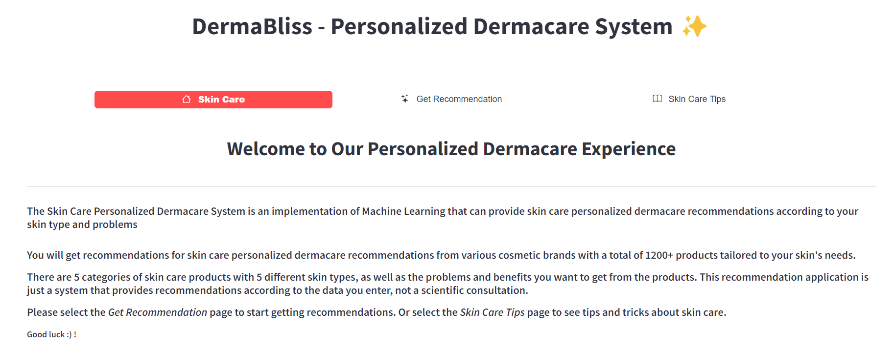

# DermaBliss-Personalized-Dermacare-System


## Introduction

### 1.1 Abstract

Machine learning, a subset of artificial intelligence, has emerged as a powerful tool with the ability to extract valuable insights from vast datasets. By leveraging algorithms that learn from data, machine learning models can identify patterns, make predictions, and automate tasks that were once time-consuming or error-prone.

Dermatology is a unique area of medicine because diseases affecting the integumentary system manifest externally and are constantly on public display. Dermatological conditions are a relevant health problem.

Machine learning (ML) models are increasingly applied to dermatology as diagnostic decision support tools, especially for skin cancer detection and disease classification. In addition to providing medical therapy, dermatologists are consulted for improving the appearance of many disfiguring conditions.

DermaBliss is designed as a clinical decision support system that enhances medical decisions, aids therapeutic decisions, and improves patient safety. Key features include evidence-based treatment options for dermatological conditions and a smart search for drug reactions.

### 1.2 Problem Definition

The skincare industry is vast and often overwhelming, with countless products available for various skin types and concerns. Individuals often struggle to navigate this complex landscape and find effective skincare solutions tailored to their specific needs.

**DermaBliss** aims to address this challenge by providing a personalized skincare recommendation platform. By leveraging machine learning algorithms, DermaBliss analyzes user-provided information about their skin type, concerns, and preferences to offer tailored product suggestions and personalized skincare tips. This eliminates the need for trial and error and helps users achieve optimal skin health efficiently.

### 1.3 Aims and Objectives

The aim of this project is to develop a web application using Streamlit. Using machine learning algorithms, **DermaBliss** analyzes your unique skin type, concerns, and preferences to provide tailored recommendations. Simply input your skin details, and our intelligent system will curate a personalized skincare routine that addresses your specific needs.

#### Objectives:
1. Collecting skin-related datasets distinguishing between benign and malignant skin cells, skin types, skin colors, etc.
2. Pre-processing data using labeling, noise removal, and data augmentation.
3. Training models using datasets such as CSV files from Kaggle.
4. Training the model using Content-Based Filtering techniques like TF-IDF Vectorization and Cosine Similarity.
5. Evaluating metrics such as Accuracy, Precision, and Error rate.
6. Comparative study of the model with available applications in the market.

### 1.4 Scope of the Project

**DermaBliss** is a web-based application designed to provide personalized skincare recommendations and tips to users based on their individual skin characteristics and concerns. By leveraging machine learning algorithms, **DermaBliss** aims to simplify the often-complex process of selecting suitable skincare products and create a more efficient and effective skincare routine.

#### Key Features and Functionality:
- **Skin Analysis Questionnaire**: A comprehensive questionnaire to gather essential data about the user's skin, including sensitivity, oiliness, and specific issues like acne or dryness.
- **Personalized Product Recommendations**: Based on the collected data, **DermaBliss** will recommend suitable skincare products, considering ingredients, brands, and user preferences.
- **Skincare Tips and Advice**: The platform will provide personalized skincare tips on cleansing, moisturizing, exfoliating, and sun protection.
- **Data Privacy and Security**: Prioritizing data privacy and security, ensuring that user information is handled responsibly and in compliance with relevant regulations.

#### Technical Implementation:
- **Machine Learning Algorithms**: Content-Based Filtering, TF-IDF Vectorization, Cosine Similarity to analyze user data and generate accurate product recommendations.
- **Web Development Framework**: Streamlit for building the user interface and ensuring a seamless user experience.
- **Backend Development**: TensorFlow (for machine learning), Scikit-learn (for TF-IDF and cosine similarity calculations) to handle data storage, server-side logic, and integration with models.
- **Dataset**: CSV files from Kaggle that provide product information and recommendation results.

By providing personalized skincare recommendations and expert advice, **DermaBliss** empowers users to make informed choices about their skincare routines and achieve healthier, more radiant skin.

## System Description

### 2.1 System Design


### 2.2 Hardware and Software Requirements

#### Hardware Requirements:
- **Laptop or PC**:
  - Windows 7 or higher
  - Intel Core i3 or i5
  - 4GB RAM or higher
  - 2GB Disk Space or higher
- **Android Phone** (6.0 and above)

#### Software Requirements:
- **Programming Language**: Python
- **Libraries**: Streamlit, Scikit-learn, Pandas, NumPy, Matplotlib, Seaborn, Plotly (for interactive plots), PIL (for image handling)
- **Development Tools**: Jupyter Notebooks, VS Code
- **Operating System**: Windows/Linux/Mac

### 2.3 Methodology

1. **Requirements Gathering**: Identify and document the project’s features, functionalities, and user interface design.
2. **Design**: Create system architecture and user interface design to meet the project’s requirements.
3. **Development**: Write and test the system's code according to the documented requirements and design.
4. **Testing**: Rigorously test the system to ensure it meets requirements and is bug-free.
5. **Deployment**: Deploy the system to the production environment, ensuring security, reliability, and scalability.

## Conclusion and Future Scope

### Conclusion

**DermaBliss** represents a significant advancement in personalized skincare solutions. By harnessing the power of machine learning, the application successfully addresses the challenges faced by individuals navigating the complex skincare market.

The ability to provide tailored product recommendations based on individual needs is a key strength of **DermaBliss**. The application's user-friendly interface and comprehensive database of skincare products further enhance its value.

While **DermaBliss** has demonstrated its effectiveness in providing personalized skincare guidance, there is ample room for future growth and development. By incorporating additional features, expanding its product database, and exploring new technologies, **DermaBliss** can continue to evolve and offer even more comprehensive skincare solutions.

In conclusion, **DermaBliss** has the potential to revolutionize how individuals approach skincare, empowering them to make informed choices and achieve optimal skin health. As the application continues to evolve, it is poised to become an indispensable resource for skincare enthusiasts worldwide.

### Future Scope

**DermaBliss** has the potential to expand its capabilities and features to further enhance the user experience and address evolving skincare needs. Some future directions include:
- **Incorporating Image Analysis**: Allow users to upload photos of their skin for a more accurate assessment and personalized recommendations.
- **Integrating with Wearable Devices**: Explore integrating with wearable devices to track skin health metrics and provide real-time recommendations.
- **Offering Personalized Skincare Routines**: Generate personalized skincare routines based on user data, incorporating factors like lifestyle, environment, and seasonal changes.
- **Exploring AI-Powered Virtual Dermatologist**: Investigate incorporating AI-powered virtual dermatologists to offer consultations and answer user questions.

## Installation

### Prerequisites

Before running the project, ensure you have the following installed:

- Python 3.7+
- Pip (Python Package Installer)

### Installation Steps

1. Clone the repository:
   ```bash
   git clone https://github.com/your-username/dermabliss.git
2. Navigate to the project directory:
   ```bash
   cd dermabliss
3. Install the required dependencies:
   ```bash
   pip install -r requirements.txt
4. Run the application:
   ```bash
   streamlit run app.py

## Contributors
Our project's success is a testament to the power of teamwork and collaboration. Each member of our team brought unique skills, knowledge, and enthusiasm to the table, contributing to the project's development in diverse ways.
Here are our group members:

1. [Mangesh Pangam](https://github.com/Mangesh2704)

2. [Rakshita Sarap](https://github.com/RakshitaSarap)

3. [Saish Rane](https://github.com/saishrane-11)

## Acknowledgements
Thanks to Kaggle for providing the datasets.
Special thanks to the contributors and the open-source community for their tools and resources.

#### Live Demo: https://dermabliss-personalized-dermacare-system.onrender.com
